<!-- Note: GitHub does not apply custom fonts or full CSS, but we use a styled div for visual grouping -->

# 🚀 LunchBox

A one-stop mobile application for all your homely cravings.  
*Our mission:* You're always one order away from ghar ka khana!

## 📘 Project Overview

*LunchBox* is a tiffin delivery application aiming to bring regional, home-cooked Indian meals straight to your doorstep.  
Whether you're a student, a working professional, or simply craving something homely — we've got your back.

## 🌟 Key Features

---

### 🍱 1. Choose Nutritious and Affordable Meals

Select from a variety of healthy and budget-friendly meal options. Explore diverse Indian cuisines and enjoy wholesome meals that suit your preferences.

  
  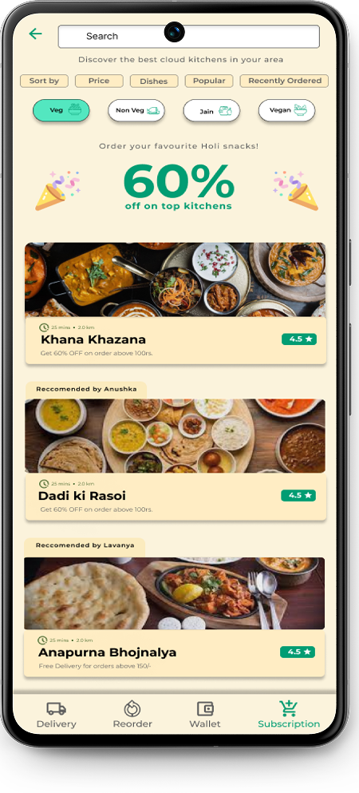

 

  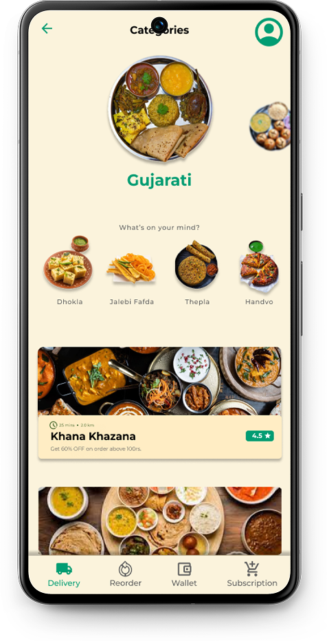
  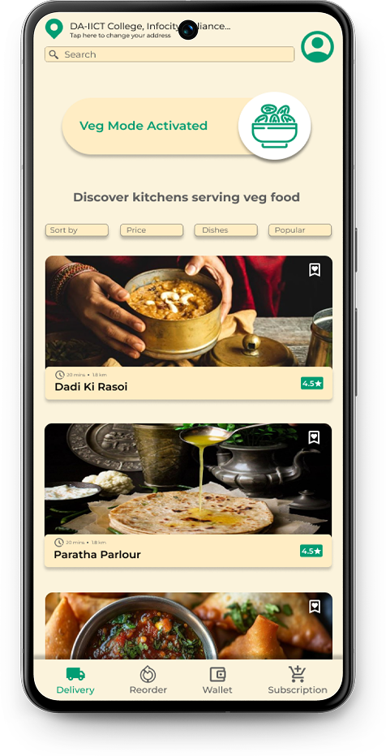

---

### 💳 2. Seamless Payment through Wallet Service

Integrated wallet support for quick and secure transactions. Top-up and manage wallet balance effortlessly within the app.

  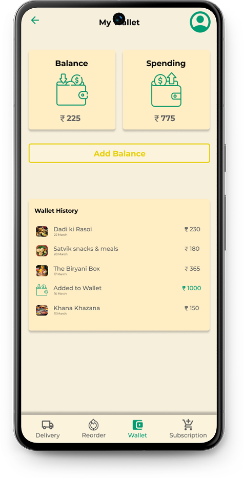

---

### 🧑‍🍳 3. Subscribe to Your Favorite Kitchens

Follow and subscribe to home kitchens or regional favorites for daily or scheduled meals. Reliable and personalized meal delivery at your fingertips.

  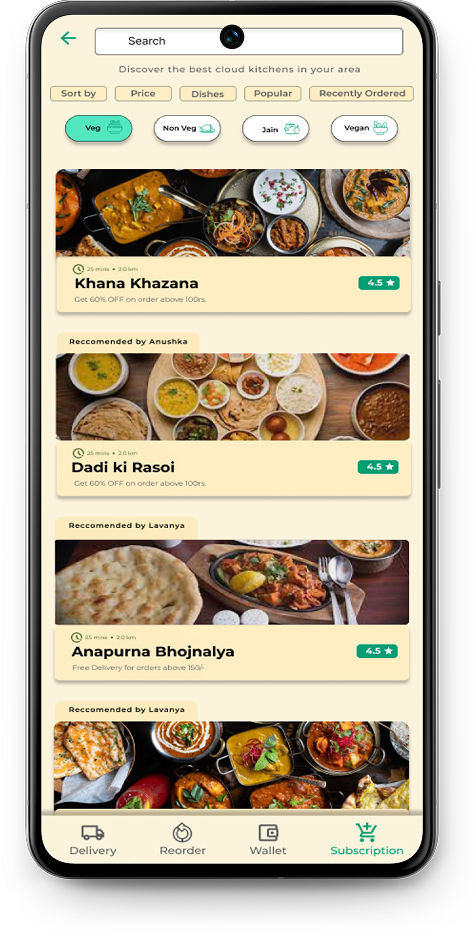
  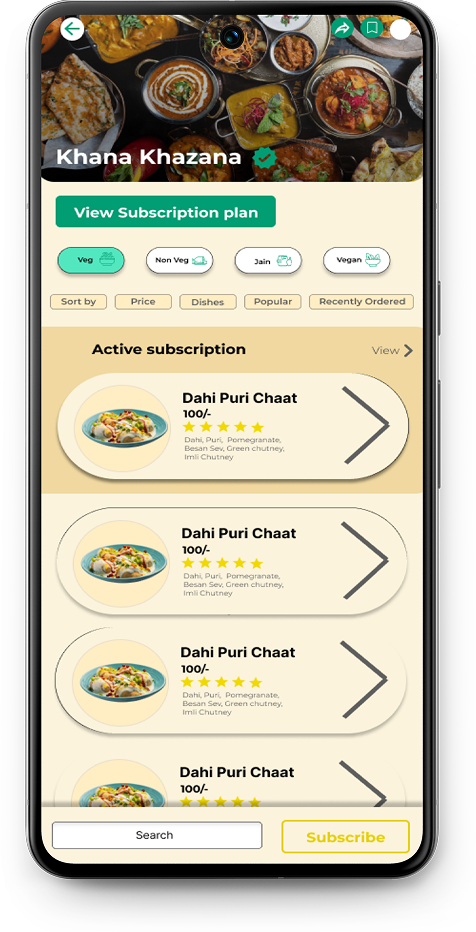

---

### 📦 4. Flexible Subscription Plans

Opt for weekly, monthly, or custom plans tailored to your needs and budget. Ideal for students, bachelors, and working professionals.

  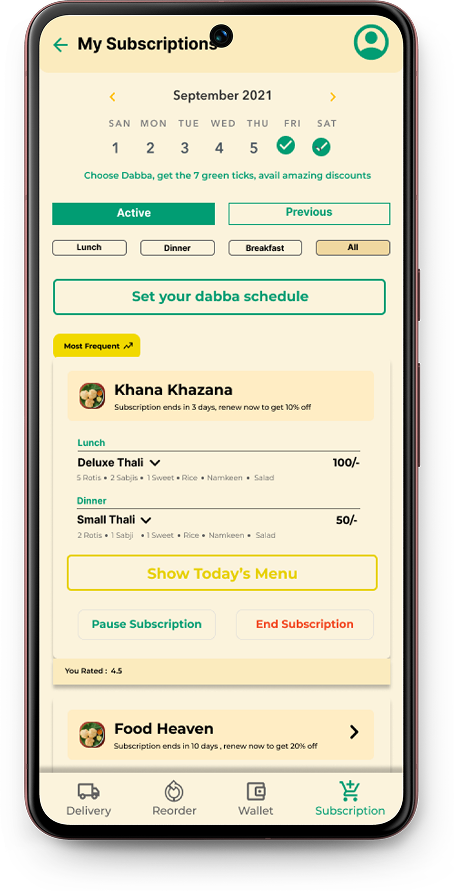
  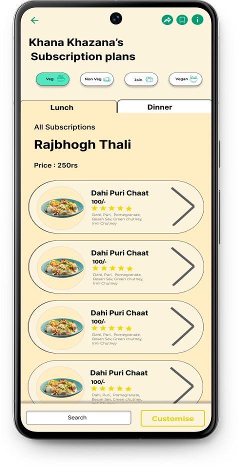

---

### 🗓️ 5. Track Your Subscriptions

Stay up-to-date with active, paused, and completed subscriptions. Get timely reminders and monitor your delivery history.

  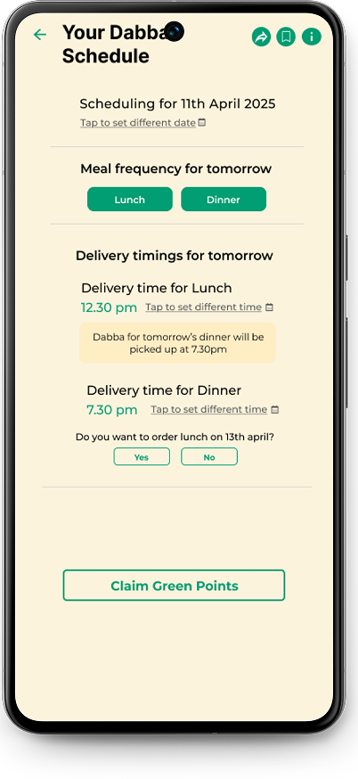
  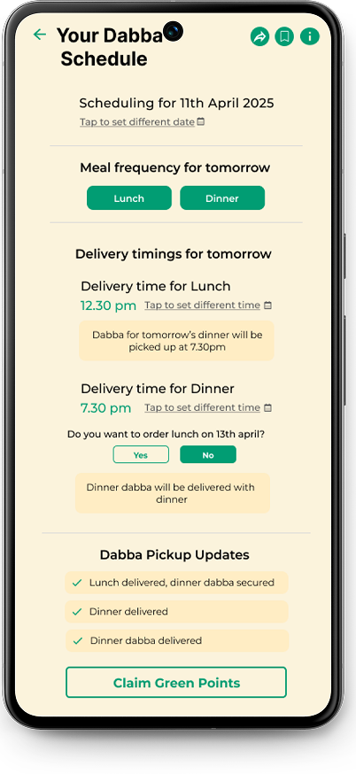

---

### 🌿 6. Earn Green Points via Dabba Service

Go eco-friendly with our Dabba (tiffin) delivery system and earn Green Points. Redeem points for discounts and exclusive offers.

  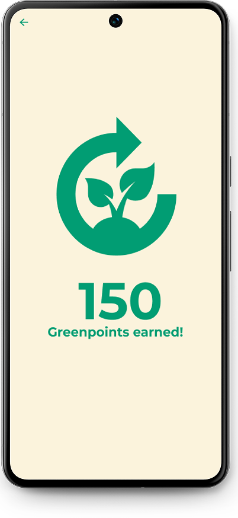

## 🎨 Figma Prototype

👉 [Click here to view the Figma File](https://www.figma.com/proto/ZozD8aeksZBIKHYieNX6y1/UX?node-id=0-1&t=JOHFps7DdmT2BP8I-1)

## 🧑‍🤝‍🧑 Group Members

 

